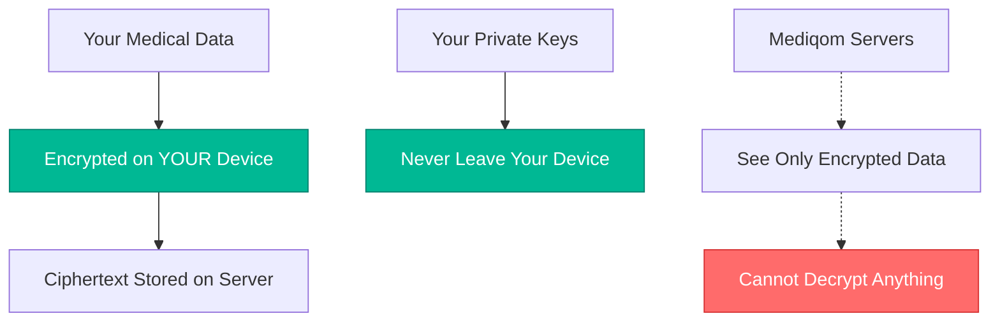
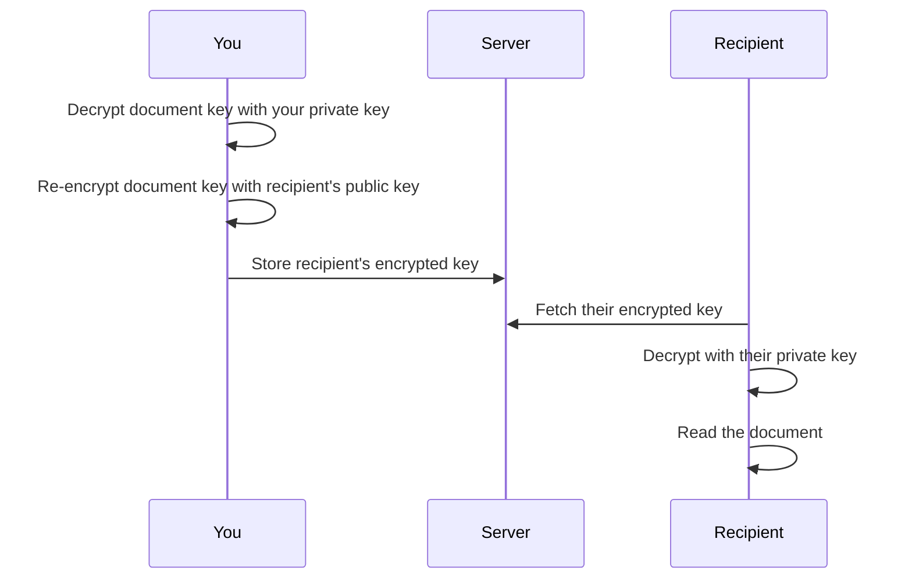

# Your Data Stays Yours

## Zero-Knowledge Security — Verified by Independent Audit

Your medical records are encrypted on your device before they ever reach our servers. We don't have your keys. We can't read your data. This isn't a promise — it's how the system is built.

---

## How It Works

Every piece of medical data you store in Mediqom is encrypted on your device using keys that only you control. Our servers store ciphertext — encrypted data that is useless without your keys.

### Key Generation

1. **Created on your device** — your encryption keys are generated locally using your browser's built-in cryptography engine
2. **Protected by your passphrase** — your private keys are encrypted with a key derived from your passphrase (PBKDF2, 300,000 iterations)
3. **Never transmitted** — your passphrase and private keys never leave your device
4. **One key per document** — each document gets its own unique encryption key for forward secrecy

---

## Encryption Standards

Mediqom uses well-established, audited cryptographic algorithms:

| Layer | Algorithm | Purpose |
|-------|-----------|---------|
| Document encryption | **AES-256-GCM** | Each document encrypted with a unique random key |
| Key wrapping | **RSA-4096-OAEP** | Your public key protects each document key |
| Post-quantum wrapping | **ML-KEM-768** (FIPS 203) | Hybrid layer resistant to quantum computers |
| Passphrase derivation | **PBKDF2-SHA256** | 300,000 iterations to protect your private key |
| Recovery key derivation | **HKDF-SHA256** | Derives encryption key from your recovery key |

All operations use the Web Crypto API — no custom cryptography.

---

## Post-Quantum Ready

Quantum computers may eventually break RSA encryption. We've already prepared for that.

New accounts use **hybrid key wrapping**: every document key is protected by both RSA-4096 and ML-KEM-768 (a lattice-based algorithm standardized as FIPS 203). An attacker would need to break **both** algorithms to access a single document key.

This approach follows guidance from **ANSSI** (France) and **BSI** (Germany), which recommend hybrid post-quantum schemes for sensitive data through at least 2030.

Legacy RSA-only accounts continue to work seamlessly and can upgrade to hybrid mode.

---

## What We Can See vs. What We Can't

### We CAN see:

- That you have an account (email, creation date)
- Number of documents stored (not their content)
- Number of profiles (not their medical data)
- API usage and system performance metrics
- Sharing metadata (who shared with whom, not what was shared)

### We CANNOT see:

- Your medical records, lab results, or prescriptions
- Your uploaded document contents or images
- Your AI analysis results
- Your session conversations or transcripts
- Your private encryption keys or passphrase

---

## Secure Document Sharing

You can share specific documents with other Mediqom users. Sharing uses per-recipient key encryption — each recipient gets their own encrypted copy of the document key.

### How sharing works:

- **Per-recipient encryption** — each recipient's copy of the document key is encrypted with their public key
- **Revocable** — delete the recipient's key entry and they lose access immediately
- **New user sharing** — if the recipient doesn't have an account yet, the key is encrypted with a temporary share secret until they sign up
- **Hybrid-aware** — if the recipient has a hybrid (post-quantum) key, sharing automatically uses hybrid wrapping

---

## HIPAA & Regulatory Compliance

| Requirement | Status | Details |
|-------------|--------|---------|
| Encryption at rest | Implemented | AES-256-GCM per document, unique keys |
| Encryption in transit | Implemented | TLS for all connections |
| Access controls | Implemented | Per-document key wrapping, Supabase Row Level Security |
| Audit logging | Implemented | Server-side audit trail on all data access and modifications — zero-knowledge (no plaintext medical data in logs) |
| Data retention | Implemented | User-controlled deletion, import job TTL |
| Unique user identification | Implemented | Supabase Auth with email verification |

### In progress:

- **HSTS preload** — HTTP Strict Transport Security headers (partially configured)
- **Minimum necessary access** — further scoping of internal data access patterns

We are transparent about what's complete and what's still in progress. No certifications (SOC 2, ISO 27001) have been obtained yet.

---

## Your Recovery Options

If you forget your passphrase, you have two recovery paths:

1. **Recovery key** — a 40-character code (200 bits of entropy) generated when you set up encryption. It can decrypt your private keys independently of your passphrase. Save it somewhere safe — we recommend printing the PDF with QR code.

2. **Passkey PRF** — if your device supports WebAuthn PRF extensions (e.g., hardware security keys), your passkey can derive a separate decryption key for your private keys.

### Important:

If you lose your passphrase **and** your recovery key **and** don't have a passkey with PRF — your data is permanently unrecoverable. This is by design. We cannot reset your encryption or recover your keys, because we never have access to them.

---

## AI Processing & Privacy

When you import documents, their content is sent to AI providers (OpenAI, Google, Anthropic) for analysis. This is the one point where unencrypted content leaves your device — it's necessary for AI-powered extraction to work.

**Mitigations:**

- AI processing uses ephemeral per-job encryption keys (30-minute TTL, never persisted)
- Results are encrypted before storage
- AI providers' data processing agreements prohibit training on your data
- You can review exactly what was extracted before saving

This trade-off is documented in our privacy policy.

---

## Contact

For security concerns or vulnerability reports:

- **Email**: security@mediqom.com
- **Response time**: We aim to acknowledge security reports within 48 hours

---

_Built with zero-knowledge encryption, verified by audit, transparent about what's done and what's in progress._
